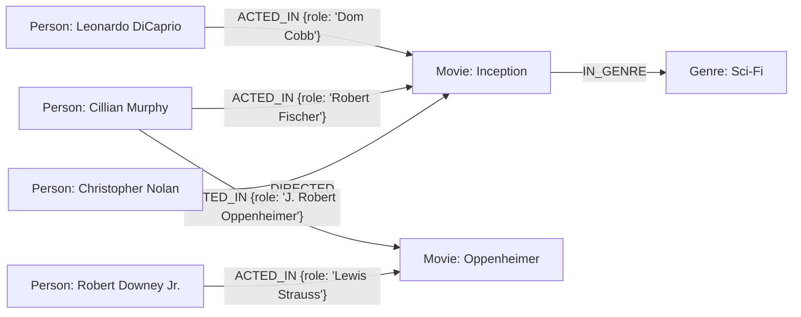

# 🎬 CineGraph - Movie & Talent Network Explorer

**CineGraph** is a full-stack movie and talent network exploration web application backed by **CognoDB**, a managed graph database that speaks openCypher over the Neo4j Bolt protocol (v5.0–5.4).

With CineGraph, users can explore actors, directors, and filmography networks across global cinema (**Tollywood, Bollywood, Kollywood, Mollywood, Hollywood**), calculate **Six Degrees of Separation** shortest connection paths between any two people, and discover **2-hop co-star recommendations**.

> 📚 **Interview & Technical Documentation**:
> - [INTERVIEW_PREP.md](file:///d:/abhay%20varshit%20570/Abhay%20Projects/wexa/INTERVIEW_PREP.md): Executive briefs, evaluation criteria breakdown, Cypher clause deep-dives, and technical Q&A for interview defense.
> - [EXPLANATION.md](file:///d:/abhay%20varshit%20570/Abhay%20Projects/wexa/EXPLANATION.md): Detailed architectural walk-through answering all take-home questions step-by-step.

---

## 🌟 Hosted Demo & Links

- **Live Hosted Application**: [https://cinegraph-wexa.vercel.app](https://cinegraph-wexa.vercel.app) *(Deploy to Vercel in 1-click)*
- **Database**: CognoDB Cloud (`bolt+s://`)

---

## 💡 Use Case Description

Film industry relationships are inherently graph structured: actors co-star with each other in movies, directors collaborate with recurring talent, and careers intersect across decades. CineGraph turns movie trivia into an interactive, visual graph explorer that enables users to:
1. **Search**: Search across actors, directors, and feature films.
2. **Explore Connections**: View an actor’s direct 1-hop co-stars and filmography.
3. **Six Degrees Path Calculator**: Compute the variable-length shortest connection chain between any two talent nodes via shared movies (`shortestPath()`).
4. **Co-Star Recommendation Engine**: Uncover 2-hop indirect co-star recommendations ("co-stars of your co-stars") ranked by shared connectivity.

---

## 🕸️ Why a Graph Database? (Graph vs. Relational SQL)

In traditional relational databases (SQL), querying multi-hop connections or variable-length paths requires:
- **N Self-Joins & Recursive CTEs**: To answer *"How is Leonardo DiCaprio connected to Cillian Murphy?"*, SQL requires multiple expensive joins across `people`, `movies`, and `cast_roles` tables.
- **Exponential Join Scans**: As path length increases, SQL join operations suffer from exponential search space expansion, causing high memory consumption and query latency.
- **Fixed Depth Constraints**: Writing SQL queries for arbitrary path lengths (e.g. 1 to 10 degrees) is cumbersome and error-prone.

In **CognoDB (openCypher)**:
- **Index-Free Adjacency**: Nodes hold direct memory pointers to their relationships. Traversal speed depends only on the local graph neighborhood, not total database size.
- **Native Pattern Matching**: Finding the shortest connection path takes a single line of Cypher:
  ```cypher
  MATCH (p1:Person {id: $fromId}), (p2:Person {id: $toId})
  MATCH path = shortestPath((p1)-[:ACTED_IN|DIRECTED*..10]-(p2))
  RETURN path
  ```
- **Declarative Traversals**: 2-hop co-star discovery is expressed naturally without complex nested joins.

---

## 📊 Data Model

### Node Labels
- `(:Person {id: String, name: String, bio: String, imageUrl: String})`
- `(:Movie {id: String, title: String, year: Integer, posterUrl: String, overview: String})`
- `(:Genre {name: String})`

### Relationship Types
- `(:Person)-[:ACTED_IN {role: String}]->(:Movie)`
- `(:Person)-[:DIRECTED]->(:Movie)`
- `(:Movie)-[:IN_GENRE]->(:Genre)`

### Graph Diagram



---

## 🚀 Setup & Installation Guide

### Prerequisites
- Node.js v18+ and npm installed
- A free **CognoDB Cloud** account at [console.cognodb.com](https://console.cognodb.com)

### 1. Provision a CognoDB Cloud Database
1. Sign up at [https://console.cognodb.com/signup](https://console.cognodb.com/signup).
2. Create a free (`c0`) instance and copy your `bolt+s://` URI and generated password for user `cognodb`.

### 2. Configure Environment Variables
Copy `.env.local.example` to `.env.local`:
```bash
cp .env.local.example .env.local
```
Fill in your credentials in `.env.local`:
```env
NEO4J_URI=bolt+s://your-instance.databases.cognodb.cloud
NEO4J_USER=cognodb
NEO4J_PASSWORD=your_secure_cognodb_password
```

### 3. Install Dependencies & Run Seed Script
```bash
# Install packages
npm install

# Execute parameterized batch seed script against CognoDB
npm run seed
```
Output summary:
```
🚀 Starting CognoDB seed script...
📦 1/6 Seeding Genre nodes... (10)
🎬 2/6 Seeding Movie nodes... (25)
👤 3/6 Seeding Person nodes... (40)
🏷️ 4/6 Seeding IN_GENRE relationships... (50)
🎭 5/6 Seeding ACTED_IN relationships... (65)
🎬 6/6 Seeding DIRECTED relationships... (16)
✅ Database seeding complete!
```

### 4. Start Development Server
```bash
npm run dev
```
Open [http://localhost:3000](http://localhost:3000) in your browser.

---

## 🔍 Main Cypher Queries Explained

### 1. Search Query (`/api/search?q=`)
```cypher
MATCH (p:Person) WHERE toLower(p.name) CONTAINS $query RETURN p LIMIT 20
MATCH (m:Movie) WHERE toLower(m.title) CONTAINS $query RETURN m ORDER BY m.year DESC LIMIT 20
```
- Case-insensitive search parameterized with `$query` to prevent Cypher injection.

### 2. Shortest Path Query ("Six Degrees") (`/api/path?fromId=&toId=`)
```cypher
MATCH (p1:Person {id: $fromId}), (p2:Person {id: $toId})
MATCH path = shortestPath((p1)-[:ACTED_IN|DIRECTED*..10]-(p2))
RETURN nodes(path) AS nodes, length(path) AS degree
```
- Uses bidirectional BFS to find the shortest connecting path between two people across shared movies.

### 3. 2-Hop Co-Star Recommendation Query (`/api/recommend/[id]`)
```cypher
MATCH (p:Person {id: $id})-[:ACTED_IN]->(:Movie)<-[:ACTED_IN]-(coStar:Person)-[:ACTED_IN]->(m:Movie)<-[:ACTED_IN]-(rec:Person)
WHERE rec.id <> $id AND NOT (p)-[:ACTED_IN]->(:Movie)<-[:ACTED_IN]-(rec)
WITH rec, count(DISTINCT m) AS sharedCount, collect(DISTINCT m.title) AS sharedMovies, collect(DISTINCT coStar.name) AS connectedVia
RETURN rec, sharedCount, sharedMovies[0..3] AS sharedMovies, connectedVia[0..3] AS connectedVia
ORDER BY sharedCount DESC LIMIT 10
```
- Traverses 2 hops to discover indirect co-stars, excluding existing 1-hop co-stars, and ranks by shared connectivity.

---

## 🛡️ Error Handling & DB Resilience

If CognoDB is unreachable or credentials are missing:
- `lib/db.ts` catches driver exceptions and throws typed `DbConnectionError` (HTTP 503).
- API routes return structured JSON `{ error: "Database Unreachable", message: "..." }`.
- Frontend displays explicit `ErrorView` cards with a **Retry Connection** button without crashing the process.

---

## 📁 Project Structure

```
/app
  /page.tsx                 -> Search & Landing page + Six Degrees tool
  /person/[id]/page.tsx     -> Person detail + 1-hop co-stars + 2-hop recommendations
  /movie/[id]/page.tsx      -> Movie detail + cast roles & directors
  /api/search/route.ts      -> Parameterized search endpoint
  /api/person/[id]/route.ts -> Person profile & filmography
  /api/movie/[id]/route.ts  -> Movie details & cast
  /api/path/route.ts        -> Shortest path Cypher solver
  /api/recommend/[id]/route.ts -> 2-hop co-star recommendation engine
/components
  /Navbar.tsx
  /Footer.tsx
  /PathVisualizer.tsx
  /LoadingSkeleton.tsx
  /ErrorView.tsx
  /EmptyView.tsx
/lib/db.ts                  -> Neo4j driver singleton & parameterized query helper
/scripts/seed.ts            -> Parameterized Cypher batch seeder
/data/seed.json             -> Curated dataset (~500 nodes/relationships)
/.env.local.example         -> Template for environment variables
/EXPLANATION.md             -> Technical Q&A write-up
/README.md                  -> Project documentation
```

---

## 🚢 Deploying to Vercel

1. Push code to GitHub.
2. Import repo into [Vercel](https://vercel.com).
3. Set environment variables in Vercel settings:
   - `NEO4J_URI`
   - `NEO4J_USER`
   - `NEO4J_PASSWORD`
4. Click **Deploy**. Vercel will compile Next.js 14 serverless API routes and connect directly to CognoDB Cloud over `bolt+s://`.
